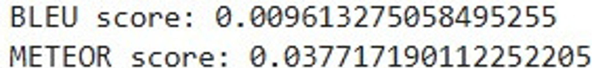
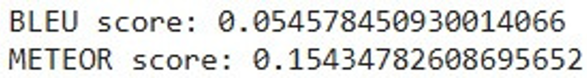
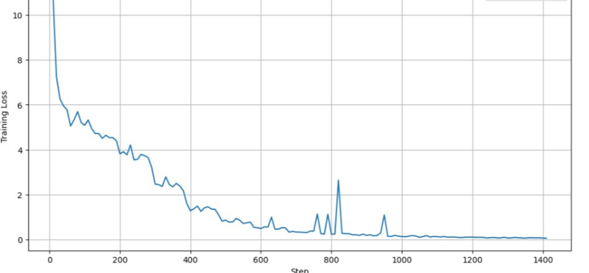

# MediVisor: Medical Visual Question Answering

## Table of Contents

- [Overview](#overview)
- [Features](#features)
- [VQA Shortcomings](#vqa-shortcomings)
- [Project Structure](#project-structure)
- [Getting Started](#getting-started)
  - [Prerequisites](#prerequisites)
  - [Installation](#installation)
  - [Usage](#usage)
    - [Predicting an Answer](#1-predicting-an-answer)
    - [Evaluating the Model](#2-evaluating-the-model)
  - [Customization](#customization)
- [Model Architecture](#model-architecture)
- [Performance](#performance)
- [Loss](#loss)
- [Examples](#examples)
- [Troubleshooting](#troubleshooting)
- [Acknowledgments](#acknowledgments)
- [Contributing](#contributing)
- [License](#license)
- [Contact](#contact)

## Overview

**MediVisor** is a Visual Question Answering (VQA) system tailored for the medical domain. It leverages state-of-the-art transformer models, specifically the ViLT (Vision-and-Language Transformer) model fine-tuned for medical images, to answer questions based on visual content. The project aims to aid medical professionals and researchers by providing automated insights and answers to medical image-related queries.

## Features

- **Real-Time Answer Prediction**: Given a medical image and a question, the model predicts the most likely answer.
- **Performance Evaluation**: The model's performance can be evaluated using BLEU and METEOR scores, which are common metrics for assessing natural language processing tasks.
- **Custom Dataset Integration**: The system is flexible and can be adapted to different datasets within the medical domain.
- **Transfer Learning**: Uses pre-trained models fine-tuned on the PathVQA dataset, making it suitable for medical applications.

## VQA Shortcomings

### Data Bias
VQA systems are trained on large datasets of images and text, and these datasets can be biased. This can lead to VQA systems that are biased in their answers.

### Open-ended Questions
VQA systems can struggle to answer open-ended questions, as these questions often require a deep understanding of context and the ability to reason.

### Commonsense Reasoning
VQA systems often lack commonsense reasoning, which can lead to them providing inaccurate or misleading answers.

### Lack of Robustness
VQA models can be sensitive to slight changes in input, such as variations in image quality or phrasing of questions. This lack of robustness can result in inconsistent performance across different scenarios.

### Ambiguity in Questions and Answers
Some questions may have multiple valid answers, and VQA systems can struggle to choose the most appropriate one. This ambiguity can lead to confusion or incorrect answers if the model is not equipped to handle it properly.

### Multimodal Integration Issues
Integrating visual and textual data effectively is challenging, and VQA models may fail to correctly align the information from both modalities, leading to errors in understanding and answering questions.

## Getting Started

### Prerequisites

Before you begin, ensure you have met the following requirements:

- **Python 3.7+** installed
- **Pip** package manager installed
- **PyTorch** and **transformers** library installed
- **nltk** library installed for BLEU and METEOR scores

### Installation

1. **Clone the Repository**:

    ```bash
    git clone https://github.com/your-username/medivisor.git
    cd medivisor
    ```

2. **Install Dependencies**:

    Install the required Python packages using pip:

    ```bash
    pip install -r requirements.txt
    ```

3. **Download the Dataset**:

    The project uses the [PathVQA dataset](https://github.com/UCSD-AI4H/PathVQA). You can load it directly using the `datasets` library:

    ```python
    from datasets import load_dataset
    ds = load_dataset("flaviagiammarino/path-vqa")
    ```

4. **Set Up the Environment**:

    If you’re using Google Colab, ensure that your runtime has GPU enabled for faster processing.

### Usage

#### 1. Predicting an Answer

Use the `predict_answer` function to predict the answer to a question based on a medical image.

```python
from src.predict import predict_answer

# Example usage
image_path = '/path/to/your/image.jpeg'
question = "What are the blue dots?"
predicted_answer = predict_answer(model, processor, image_path, question, answer_vocab)
print(f"Question: {question}")
print(f"Predicted Answer: {predicted_answer}")
```

#### 2. Evaluating the Model

Evaluate the model's performance using BLEU and METEOR scores with the `calculate_bleu_meteor` function.

```python
from src.evaluate import calculate_bleu_meteor

# Example usage
sampled_dataset = [{'image': ann['image'], 'question': ann['question'], 'answer': ann['answer']} for ann in ds['train'][:10]]
avg_bleu, avg_meteor, references, hypotheses = calculate_bleu_meteor(model, processor, sampled_dataset, answer_vocab)
print(f"Average BLEU score: {avg_bleu}")
print(f"Average METEOR score: {avg_meteor}")
```

### Customization

- **Dataset**: If you have a custom medical dataset, ensure it follows the structure expected by the `PathVQADataset` class. Modify the keys and processing steps as necessary.
- **Model Fine-Tuning**: You can fine-tune the ViLT model further on your custom dataset using the provided training scripts and the `Trainer` class from Hugging Face's `transformers` library.

## Model

### ViLT - B32 Model Architecture


### Visual Embedding Schema


## Performance

### Before Fine Tuning




### After Fine Tuning



## Loss



## Examples

You can find example notebooks in the `notebooks/` directory that demonstrate:

- How to load and preprocess the dataset.
- How to predict answers using the model.
- How to evaluate the model’s performance.

## Troubleshooting

- **CUDA Errors**: Ensure that your GPU drivers are correctly installed and that PyTorch is configured to use CUDA.
- **Model Prediction Issues**: Check if the image and question are being correctly preprocessed before being fed into the model.
- **BLEU/METEOR Calculation**: Ensure that the references and hypotheses are correctly tokenized before calculating the scores.

## Acknowledgments

This project is built upon the work of many open-source projects and researchers. Special thanks to:

- The authors of the [ViLT](https://github.com/dandelin/ViLT) model.
- The creators of the [PathVQA](https://github.com/UCSD-AI4H/PathVQA) dataset.
- The Hugging Face team for their incredible [transformers](https://github.com/huggingface/transformers) library.

## Contributing

Contributions are welcome! If you'd like to contribute, please fork the repository and use a feature branch. Pull requests are warmly welcome.

## License

This project is licensed under the MIT License - see the [LICENSE](LICENSE) file for details.

## Contact

For further queries, feel free to reach out:

- **Gmail** - [samama4200@gmail.com](samama4200@gmail.com)
- **LinkedIn** - [www.linkedin.com/in/samama-](www.linkedin.com/in/samama-)
